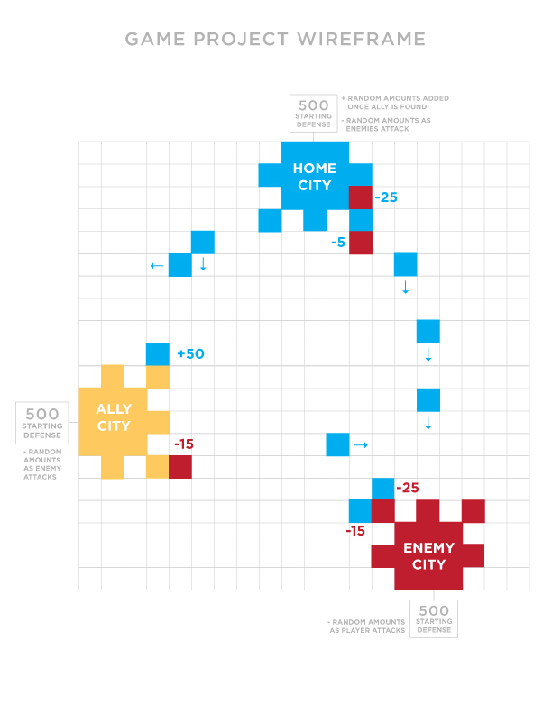

# Game Project

I want to build an original Warcraft style game where you build up a city's defenses, guard against attacking enemies and wander the map 
fighting enemies and gathering friends. It will be a basic grid layout where the player moves around the squares freely until they run into 
an enemy horde. Then a battle ensues. Battle options will be pretty simple, archers shooting projectiles and knights fighting on the ground.
Battles will start automatically upon entering a square occupied by an enemy. All attacks will have randomized accuracy and damage. Player 
will have a home base to defend. If it is destroyed, the game ends. Ideally there will be 2+ computer enemy cities to fight and 1 city that 
will ally with you and add to your attack force. Game is won once all enemies are destroyed.

## Steps for MVP
* Create a grid.
* Create home city to defend. Defense set at 500. 
* Create fighters and make them able to move around the board.
* Create enemy city with enemies that defend their city.
* Set up timer.
* Have enemies pop up and randomly attack home city.
* As time increases, so do enemy hordes.
* Home city defense goes up as player levels up. 

## Bonus Objectives
* Create ally city that will add to player's attack and defense as long as player is near it.
* Player needs to protect ally city + home city.
* Player can build new buildings in their home city that will increase attack and/or defense.
* Player can find random things that add to attack/defense around the board.
* Fighters include knights that fight in close proximity and archers that can launch projectiles.
* Enemy fighters also randomly wander or spawn anywhere on the board.
* Create more enemy and ally cities.
* Bigger body/side scroll

